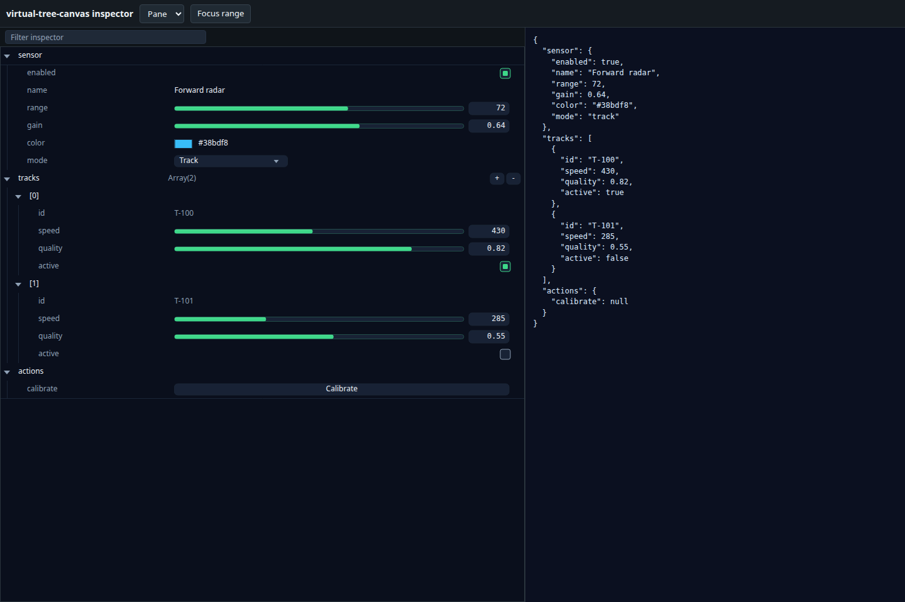
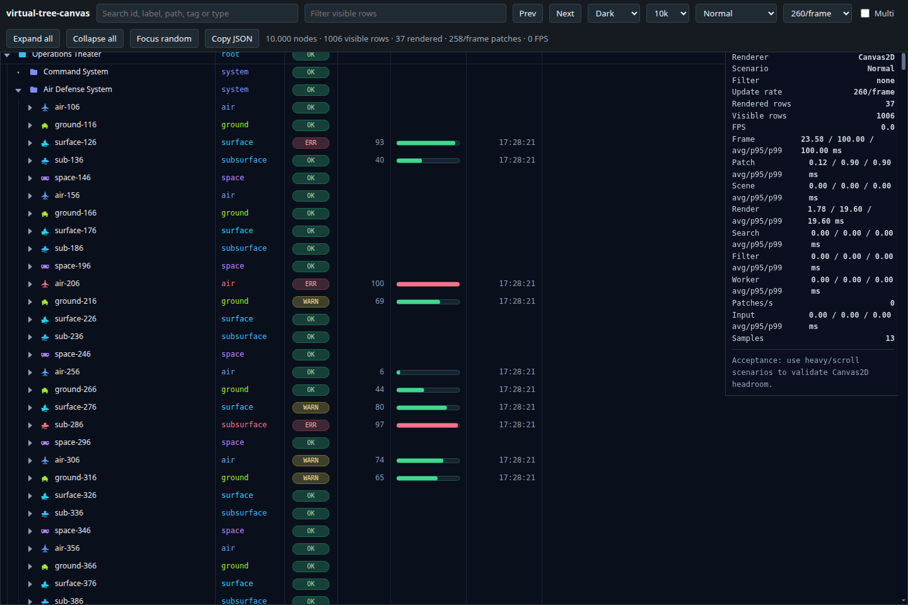

# virtual-tree-canvas

**A fast, framework-agnostic tree and tree-table for large hierarchical data.**

`virtual-tree-canvas` gives applications the interactions users expect from a
native tree view—expandable branches, columns, selection, search, filtering and
keyboard navigation—without creating a DOM node for every row. It renders only
what is visible with Canvas2D, so it stays responsive as data and live updates
grow.



## Why use it?

- **Built for large trees.** Only visible rows plus a small overscan range are painted.
- **Interactive by default.** Tree-table columns, sorting, resizing, selection, focus, tooltips and keyboard navigation are included.
- **Good for live data.** Batched state patches update status, progress and values without rebuilding the tree.
- **Framework-free.** Use it directly from browser JavaScript; no React or Web Component runtime is required.
- **Easy to style.** Built-in dark, light and tactical themes, type-based styling, and editable SVG icons.
- **Ready for inspectors.** Turn plain JavaScript objects into compact editable forms or property tables.

See [the changelog](./CHANGELOG.md) for migration notes and additions.

## Install

```bash
npm install virtual-tree-canvas
```

## Quick start: complete DOM view

Give the host an explicit height. `TreeView` mounts its canvas, filter, tooltip
and editors, observes size changes and schedules rendering itself.

```html
<div id="assets-tree" style="height:480px"></div>
```

```js
import { TreeView } from 'virtual-tree-canvas';

const view = new TreeView(document.querySelector('#assets-tree'), {
  initialExpandDepth: 2,
  rowReorder: true,
  iconsBaseUrl: '/node_modules/virtual-tree-canvas/resources/icons/'
});
view.setData([
  { id: 'fleet', label: 'Fleet', icon: 'folder' },
  { id: 'radar-1', parentId: 'fleet', label: 'Forward radar', icon: 'radar' },
  { id: 'track-100', parentId: 'radar-1', label: 'Track T-100', icon: 'track' }
]);
view.setDynamicState([{ id: 'track-100', state: { value: 430 } }]);
view.configure({ editable: false, rowHeight: 32 });
view.on('rowreorder', ({ detail }) => console.log(detail.order));
const tree = view.controller; // optional lower-level operations
// On permanent unmount: view.destroy();
```

`configure(patch)` batches changes in a microtask. Public operations and reading
`view.controller` flush pending configuration first; `view.flush()` is also
available. Editability, theme, filter visibility and icon resolution preserve
manual order, selection, expansion and live values. `setData` and `setModel`
explicitly reinstall data even when the same mutated reference is supplied.

- `mode`: `tree` (default) or `inspector`; `presentation`: `pane` or `table`.
- `filterPlacement`: `auto` (bar in tree/pane, first-column header in inspector
  table), `bar` or `header`. Set `filter: false` to hide it. Hiding the control
  preserves its query; call `clearFilter()` to clear the query.
- `columns: null` restores defaults for the current presentation.
- Explicit `rowHeight` and `indentWidth` override the theme; configure them as
  `undefined` to resume theme defaults. `initialExpandDepth` applies to future
  data installations; it does not expand or collapse the current tree.
- `fontFamily: 'inherit'` follows the host font and refreshes after fonts load.
- `iconsBaseUrl`, `iconRegistry` and `nativeScrollbars` are construction options.
- `setInspectorValue(path, value, {emit: false})` updates a value without emitting
  `valuechange` or `modelchange`. Normal writes include `source: 'api'`; editor
  writes use `source: 'user'`. Both include the model in their event details.

Use `view.configure` for view configuration. Direct controller operations are
available for interaction state (filtering, selection, sorting, navigation);
changing data or presentation through the view keeps its configuration coherent.

## Low-level canvas integration

Existing applications can keep `TreeViewController` and manage their own DOM:

```js
import { TreeViewController } from 'virtual-tree-canvas';
const tree = new TreeViewController({ canvas, host, autoRender: true });
tree.setData(rows);
```

The controller owns state and editing, including `setEditable`,
`setInspectorValue`, `closeEditor` and layout precedence. With `autoRender`
omitted, use your existing explicit `tree.render()` loop.



## Common tasks

```js
// Navigate and select
tree.expand('radar-1');
tree.focusNode('track-100', { align: 'center', select: true });
tree.setSelection(['track-100']);

// Search and filter
tree.search('forward radar');
tree.setFilter('track');
tree.clearFilter();

// Configure the tree-table
tree.setColumns(columns);
tree.sortBy('status', 'asc');
tree.resizeColumn('name', 320);

// Use a worker for expensive search/filter work
await tree.enableWorkers();
```

## Live updates and performance

Use `setDynamicState()` for values that change frequently. It updates the
dynamic state of affected nodes while retaining indexes, expansion state and
visible rows.

```js
tree.setDynamicState([
  { id: 'track-100', state: { status: 1, progress: 0.7, value: 42 } },
]);
```

`setData()`, expand/collapse, sorting and filtering are structural operations
and may rebuild the visible row list. For very large datasets,
`enableWorkers()` moves search and filtered row rebuilds off the main thread
when Workers are available.

Row actions can also use checkboxes styled like inspector controls. Set `kind: 'checkbox'` and provide
`checked` as a boolean or a function of `(node, state)`. The `rowaction` event
includes `checked`; update your application state in response. Checkbox actions
support `visible` and `disabled` and do not select or drag the row.

## Columns

Use `showHeader: false` to hide column headings while keeping the filter available.
The configured `headerHeight` is preserved when the header is shown again.

```js
tree.setColumns([
  {
    id: 'name',
    label: 'Name',
    width: 340,
    minWidth: 160,
    kind: 'tree',
    value: (node) => node.label ?? node.id,
  },
  {
    id: 'status',
    label: 'Status',
    width: 84,
    minWidth: 64,
    align: 'center',
    kind: 'status',
    value: (_node, state) => state.status,
  },
  {
    id: 'progress',
    label: 'Progress',
    width: 140,
    kind: 'progress',
    value: (_node, state) => state.progress,
  },
]);
```

Available column kinds are `tree`, `status`, `value`, `progress`, `type`,
`updated` and `text`. A column can also provide `render(ctx, cell)` for custom
Canvas2D content. Import `builtInColumns` or `defaultTreeTableColumns` to start
from the default set.

Text columns accept `format(value, node, state)` to customize displayed text and
tooltips while sorting by the original `value`. For example,
`format: value => value.toFixed(2)` displays two decimal places. By default,
numeric text uses the same precision as inspector values (up to three decimals).

## Themes and icons

Three themes are included:

```js
import { darkTheme, lightTheme, tacticalTheme } from 'virtual-tree-canvas';

tree.setTheme(tacticalTheme);
```

Inspector values and columns with `kind: 'value'` use `theme.valueColors` to
distinguish numbers, strings, booleans, enums and empty values. Read-only values
retain their contrast; disabled controls remain dimmed. Override individual
colors, for example `tree.setTheme({ valueColors: { number: '#8bd5ee' } })`.
A value column can specify `valueType: 'enum'` or a
`valueType(value, node, state)` callback when its semantic type differs from the
raw value. Formatting and sorting are unaffected.

Columns with `kind: 'status'` display compact pills using `theme.statuses`, for
example `{ Live: { label: 'Live', color: '#56ba95' } }`. Their width adapts to
the label within the column.

Themes can map domain types to a colour and icon:

```js
tree.setTheme({
  rowHeight: 28,
  font: '12px system-ui',
  types: {
    root: { icon: 'folder', color: '#38bdf8' },
    platform: { icon: 'aircraft', color: '#60a5fa' },
    sensor: { icon: 'radar', color: '#34d399' },
    warning: { icon: 'warning', color: '#facc15' },
  },
});
```

Built-in icons are editable SVG files in [`resources/icons`](./resources/icons).
They are loaded on demand and rasterized once per icon, colour, CSS size and device
pixel ratio. Rendering rows then uses a cached `drawImage`, not SVG parsing or
path drawing.

When bundling the library, configure the public directory containing its built-in SVGs:

```js
const tree = new TreeViewController({
  canvas,
  iconsBaseUrl: '/node_modules/virtual-tree-canvas/resources/icons/'
});
```

`iconsBaseUrl` also works with `new IconRegistry({ iconsBaseUrl })`. It accepts an absolute URL (including a CDN), a root-relative path, or a document-relative path. A trailing slash is optional. Supply it when constructing the controller or registry, before built-in icons begin loading. A custom `iconRegistry` takes precedence over the controller's `iconsBaseUrl`.

Without this option, unbundled modules load the icons from the package's `resources/icons/` directory. Publish that directory alongside the package; the bundler does not need to extract or rename its SVGs.

Register application icons from an SVG URL, inline SVG or an image:

```js
tree.registerIcon('camera', '/icons/camera.svg');
tree.registerIcon('satellite', '<svg viewBox="0 0 24 24"><path fill="currentColor" d="..."/></svg>');
tree.registerIcon('logo', imageElement);
```

Use `currentColor` in an SVG to inherit the type or dynamic-state colour.
`tree.iconRegistry.prepare({ icons, size, color, pixelRatio })` is also
available when an application wants to warm a known icon set before display.

## Model inspector

`setModel()` renders JSON-like data as an editable inspector. Metadata controls
the editor, bounds, choices, labels and descriptions.

```js
tree.setModel(
  {
    sensor: { enabled: true, range: 72, mode: 'track' },
    tracks: [{ id: 'T-100', speed: 430 }],
  },
  {
    'sensor.range': { min: 0, max: 120, step: 1, integer: true },
    'sensor.mode': { options: { Search: 'search', Track: 'track' } },
    'tracks.*.speed': { min: 0, max: 900, step: 5, unit: 'm/s', precision: 2 },
    'tracks.*.id': { readonly: true },
  },
  { presentation: 'pane', flatRoot: true },
);
```

Choose `presentation: 'pane'` for a compact folder-and-controls view, or
`presentation: 'table'` for Property / Value / Type / Description columns.
Editors are inferred from data and metadata: checkbox, range, number, text,
select, colour, button, object and array.

Numeric metadata supports `unit` (a display-only string suffix) and `precision`
(decimal places, 0–20). The unit has a reserved slot beside the number in both
pane and table presentations, including range sliders. It stays visible while
editing; the editor receives the full original numeric value and emits a number.
Precision changes display only, not stored values, limits or step size. Omit both
options to keep the existing formatting. Invalid precision values are ignored.
Customize the suffix with `theme.unitFont` and `theme.colors.unit` (defaults to
`textMuted`). Long units are truncated to fit the available cell width.

Listen for user edits and actions with `valuechange`, `modelchange` and
`action` events.

## Events

```js
tree.on('nodeclick', (event) => {
  console.log(event.detail.nodeId);
});
tree.on('selectionchange', (event) => {});
tree.on('expand', (event) => {});
tree.on('searchchange', (event) => {});
tree.on('filterchange', (event) => {});
tree.on('valuechange', (event) => {});
```

Other events include `nodehover`, `nodedblclick`, `collapse`, `focuschange`,
`sortchange`, `columnschange`, `viewportchange`, `modelchange` and `action`.
The payload is always available as `event.detail`.

## API overview

```js
tree.setData(nodes);
tree.setDynamicState(patches);
tree.setTheme(theme);
tree.setColumns(columns);

tree.expand(nodeId);
tree.collapse(nodeId);
tree.toggle(nodeId);
tree.expandAll();
tree.collapseAll();

tree.search(query, { caseSensitive, wholeWord });
tree.setFilter(queryOrPredicate, { caseSensitive, wholeWord });
tree.clearSearch();
tree.clearFilter();

tree.focusNode(nodeId, { align: 'start' | 'center' | 'end' | 'nearest' });
tree.scrollToNode(nodeId, 'center');
tree.scrollTo(x, y);

tree.setSelection(ids);
tree.getSelection();
tree.registerIcon(name, svgOrImage);
tree.enableWorkers();
tree.disableWorkers();
```

## Demo

```bash
npm run demo
```

Open <http://localhost:4173/demo/> for the large-tree benchmark, or
<http://localhost:4173/demo/inspector.html> for the editable inspector demo.

## Tests

```bash
npm test
```

## Manual row order

`rowReorder: true` adds a dedicated handle and Up/Down controls to a data table. Set `reorderable: false` on derived or fixed nodes to hide their ordering controls and prevent moving them manually; their parent can still move with its subtree. Dragging commits only on drop; Escape or dropping outside cancels. Alt+Up / Alt+Down moves the focused row. Edge scrolling works while dragging.

```js
const tree = new TreeViewController({
  canvas, host,
  iconsBaseUrl: '/node_modules/virtual-tree-canvas/resources/icons/',
  rowReorder: true,
  autoRender: true,
  tooltip: true,
  columns: [
    { id: 'name', kind: 'tree', label: 'Property', width: 300 },
    { id: 'value', label: 'Value', width: 120, value: (_node, state) => state.value }
  ]
});
tree.setData(favoriteRows);
tree.on('rowreorder', ({ detail }) => saveOrder(detail.order));
```

- `moveRow(id, targetIndex)` uses a zero-based index among siblings. `moveRowBy(id, offset)` and `getRowOrder(parentId = null)` are also available.
- Reordering preserves IDs, parent relationships, expansion, selected IDs and live dynamic state. `setDynamicState()` does not change order. `setData()` intentionally installs the order supplied by the host; restore a saved order before calling it.
- Reordering is disabled during sorting/filtering and for object-inspector models (`setModel`). It does not reorder JavaScript object properties or mutate inspected arrays. Use data rows (`setData`) for favorites, with stable IDs and dynamic value columns.
- The `rowreorder` detail contains `nodeId`, `parentId`, `fromIndex`, `toIndex`, `siblingOrder`, `order` and `source`. The host owns persistence and live subscriptions. One row is moved at a time, including its subtree, without reparenting.
- The order column is fixed at 72 CSS px (three 24 px targets) and cannot be sorted, resized or moved. The mode can be toggled with `setRowReorder(enabled)`. Sticky ancestor rows are omitted in this mode.
- `autoRender` coalesces rendering into an animation frame and cancels pending work on `destroy()`. It is opt-in so existing hosts with their own render loop continue to work.
- `tooltip: true` creates a reusable tooltip in `host` (or the canvas parent). The host must provide a positioned container. `attachTooltip({ host })` is also available.
- `setData(nodes, { iconResolver })` allows host-independent visual mapping without mutating the input nodes.

Open [the reorder demo](./examples/reorder-table.html) through a local HTTP server to try a table with live values. The demo's localStorage is illustrative; the library never persists user data itself.

## Icon catalogue

65 SVGs are included, with a [visual sheet](./docs/icon-catalog.html) and a [reference of available icons](./docs/icon-catalog.md). `builtinIconNames` exposes available IDs.

## Row actions and data dragging

Actions are optional accessible buttons on the right of visible rows. Their icon names use
`IconRegistry`, including registered custom icons. The host handles the action;
clicking a button does not select or expand the row.

```js
const favorites = new Set();
const view = new TreeView(host, {
  nodes,
  rowActions: [{
    id: 'favorite', preloadIcons: ['star', 'star-filled'], icon: node => favorites.has(node.id) ? 'star-filled' : 'star', label: 'Toggle favorite',
    visible: node => !node.data?.group,
    disabled: node => node.data?.unavailable === true,
    pressed: node => favorites.has(node.id)
  }],
  rowDrag: node => node.data?.reference ?? null
});
view.on('rowaction', ({detail}) => {
  if (favorites.has(detail.nodeId)) favorites.delete(detail.nodeId);
  else favorites.add(detail.nodeId);
  view.controller.requestRender();
});
```

`rowActions` accepts unique `id` and accessible `label` strings. `icon`, `visible`,
`disabled` and `pressed` may be functions receiving `(node, dynamicState)`.
`visible`, `disabled` and `pressed` also accept booleans. Buttons remain focusable
with Tab and work with Enter/Space. Only visible-row buttons are mounted; live
value updates preserve their identity and focus.

`rowDrag(node, dynamicState)` returns a payload, or `null` to disable dragging
that row. Drag from a row label or the row-order handle. Editors, checkboxes,
action buttons and expand/collapse controls retain their normal behavior.

The controller emits `rowdragstart`, `rowdragmove`, `rowdragend` and
`rowdragcancel`. Details contain `nodeId`, `payload`, `label` and, except on
cancellation, `originalEvent` with client coordinates. Connect these events to
your application's drop manager to highlight destinations and handle the drop.
The payload is captured at pointer-down; use a stable reference instead of a
snapshot of a live value. The library never moves or deletes exported data.

Dragging uses Pointer Events within a document. Escape, pointer cancellation,
loss of pointer capture, removal of the source row and destruction cancel the
gesture. Live value refreshes preserve an ongoing drag. Sorting and filtering
disable manual row reordering but still allow exporting rows. Clear the filter
and cycle the column header through ascending, descending and unsorted to
restore manual ordering. With `rowReorder: true`, Alt+Up/Down also reorders rows.

For actions whose `icon` callback changes between variants, supply `preloadIcons: ['star', 'star-filled']`. The visible action layer prepares these icons in both normal and pressed colors at the current pixel ratio before interaction.
